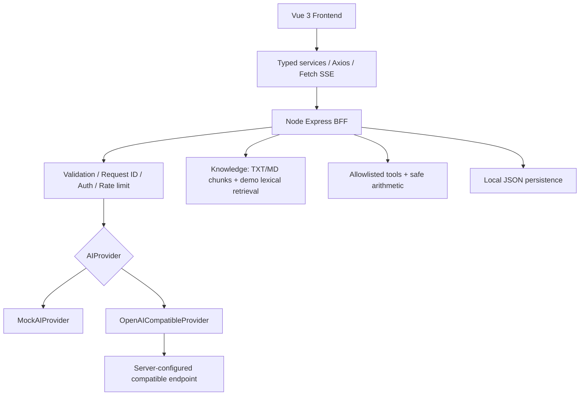
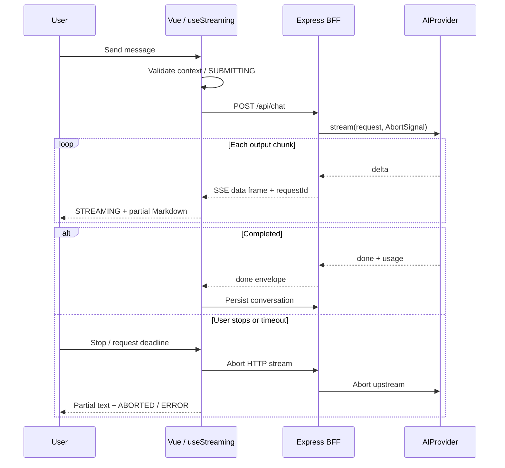
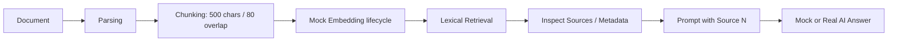
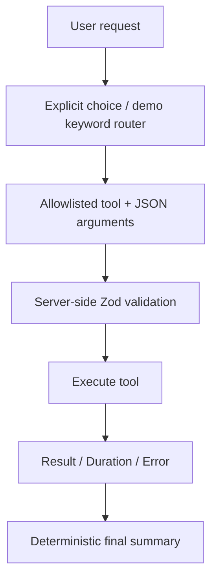
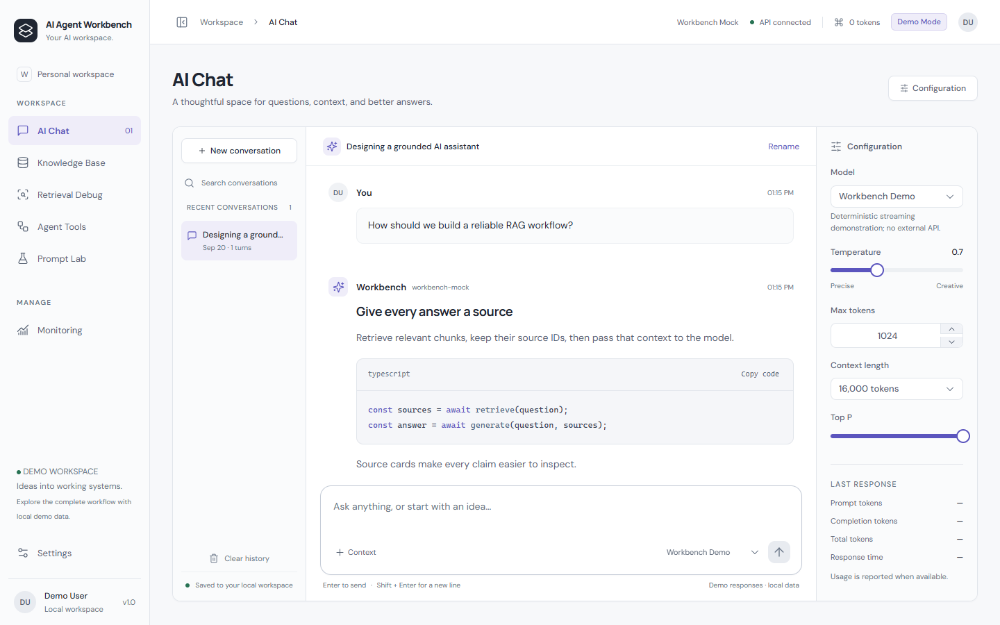
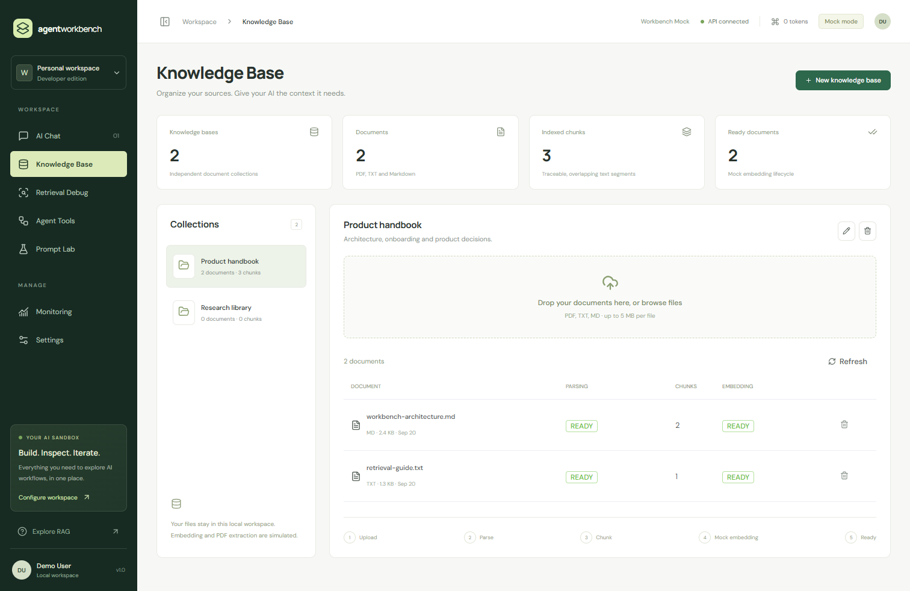
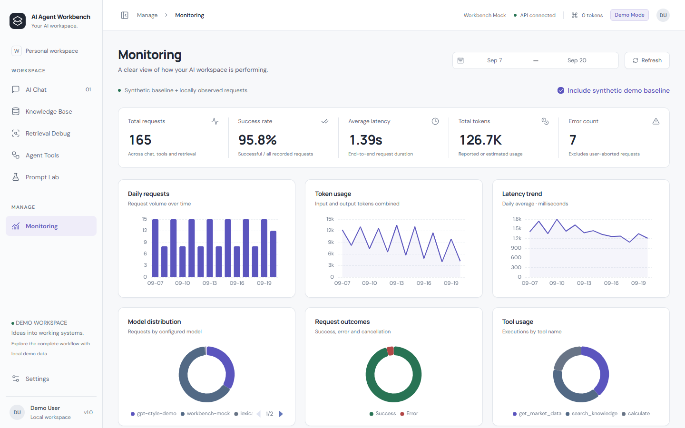

# AI Agent Workbench

一个可在本地运行、无需 API Key 即可演示的 AI 应用工作台。面向 AI 大模型前端 / AI 应用开发岗位，覆盖对话、知识库、检索调试、工具执行、Prompt 版本管理和可观测性。

**Vue 3 · TypeScript · Vite · Pinia · Element Plus · Express · ECharts**

## Project Overview

LLM 应用不只有一个输入框。用户需要知道请求是否还在执行、如何停止、为什么失败、使用了哪些上下文、工具做了什么、答案来自哪里，以及消耗了多少 Token。

本项目把这些交互集中到一个可解释的工作台。前端负责状态和可视化，Node BFF 负责服务端凭据、协议适配、输入校验、限流和本地数据持久化。

这是**本地单用户求职作品**，不是已上线的企业系统。Mock 的回答、PDF 解析、Embedding、行情、天气和历史基线均明确标记。不存在虚构客户、用户量、生产性能或召回率。

## Features

| 页面            | 已实现能力                                                                                                                                |
| --------------- | ----------------------------------------------------------------------------------------------------------------------------------------- |
| AI Chat         | 多轮上下文、system/user/assistant/tool 类型与渲染、真正的 SSE 流、停止、重试、重新生成、对话 CRUD、重命名、搜索、Markdown、代码高亮和复制 |
| Knowledge Base  | 集合 CRUD、PDF/TXT/MD 上传、大小/类型校验、状态轮询、解析失败提示/重试、Chunk 计数、文档删除                                              |
| Retrieval Debug | Query / Top K / Threshold / KB 参数、排名和分数、Chunk / Metadata、基于检索上下文的生成、独立 Sources 区域                                |
| Agent Tools     | 4 个工具、参数 JSON、执行状态、耗时、结果、失败注入与恢复；calculate 为真实本地安全算术运算                                               |
| Prompt Lab      | 模板 CRUD、Duplicate、变量插值、few-shot、生成参数、不可变版本快照、恢复到编辑器、流式测试与指标                                          |
| Monitoring      | 5 项 KPI、7 张 ECharts 图、日期范围、合成基线开关、真实本地请求记录                                                                       |
| Settings        | Mock/Real、模型、温度/输出/上下文/Top P、超时、亮暗主题、只读 API 配置、可选内存 Bearer Token                                             |

## Architecture



`shared/types.ts` 是前后端类型契约；Zod 在服务端做运行时验证。前端 API Key 不属于类型契约。

## AI Chat Architecture

- `useChat` 负责消息与会话、上下文裁剪、生成后的持久化。
- `useStreaming` 负责请求状态机、输出、超时和取消；组件卸载后停止回调更新。
- `chatStore` 保存对话数据，`settingsStore` 保存非敏感偏好。
- `selectContext` 保留 system 和最近的完整 user turn，先淘汰旧轮次，为输出预留 Token 预算；最新消息过大时显示错误，而不是悄悄丢弃。
- 明确状态：`IDLE → SUBMITTING → STREAMING → SUCCESS / ERROR / ABORTED`。重复提交通过同步锁和 UI 禁用共同阻止。
- Token 估算使用 `ceil(characters / 3)`，只是预算启发式，不是供应商 tokenizer。真实 provider 返回 usage 时优先使用真实值。
- 输入字符数在 180ms 后更新；Enter 发送、Shift+Enter 换行，并考虑 IME composition。
- Retry / Regenerate 删除最近 user 之后的旧 assistant，再用相同问题重新生成；失败输出不进入后续上下文。

## Streaming Flow



采用 POST + Fetch ReadableStream，而不是只支持 GET 的原生 EventSource。共享 parser 处理拆分帧、CRLF、跨分块 UTF-8；缺少终止事件时失败，不假报成功。Mock 每 50–150ms 发送一个文本块，走与真实模式相同的 HTTP/SSE 链路。

## RAG Flow



TXT/MD 上传内容实际读取、切块和搜索；PDF 仅生成明确标识的演示摘录。**当前没有执行真正的 Embedding，没有向量数据库，也没有语义召回质量评估。**

检索分数是 query 单词与 chunk 的重叠比例，不应解释为语义相似度。Sources 是传给模型的证据列表，不是已自动验证的引用准确率。Real Mode 只切换回答生成 provider，不会把演示检索自动升级为向量检索。

文档状态为 `PENDING → PARSING → EMBEDDING → READY`；空文本进入 `FAILED`。重试不会让无效文本自动变有效，用户需要重新上传可读内容。服务重启会恢复未完成的模拟处理。

## Function Calling Flow



不会展示模型私有推理。Auto 路由是可读的规则，最终总结也是确定性的演示逻辑；**未实现真实 LLM 自主 tool-call 循环**。`calculate` 使用递归下降解析器，禁用 `eval` / `Function` / 任意代码执行。行情和天气为虚构 fixture；知识搜索为本地词法检索。

## Frontend Architecture

路由懒加载；API 请求仅在 `src/services` / `src/api`；视图使用 Composables 与 Pinia。Element Plus 按组件导入；Markdown 支持常用语言的按需高亮；ECharts 随监控路由加载、通过 ResizeObserver 适配容器并在卸载时 dispose。

字体随项目本地打包，不依赖运行时 Google Fonts 请求。Desktop 优先，包含移动断点、可收起侧栏、移动导航和单列布局。

## State Management

| Store          | 数据职责                                 |
| -------------- | ---------------------------------------- |
| chatStore      | 会话列表、当前会话、消息、Chat 状态      |
| knowledgeStore | 知识库、文档、当前选择                   |
| promptStore    | Prompt CRUD 与版本                       |
| settingsStore  | 经过校验的非敏感偏好、连接状态、模型列表 |

会话、知识库、Prompt 和 Metrics 保存在 `server/data/workbench.json`（首次修改时创建），使用临时文件写入后 rename。只适合单 Node 进程、小规模本地数据。Settings 使用 LocalStorage；BFF access token 只在运行内存中，刷新需重新输入。

## Error Handling

- HTTP 统一格式：`{ success, data, error, requestId }`，SSE 每帧也使用此信封。
- HTTP 错误区分校验、权限、限流、网络、超时、上游失败；不把原始 provider 错误体或凭据传给浏览器。
- SSE 开始后无法重新改变 HTTP 状态码，因此错误通过终止 error 帧传递。
- Mock Chat 可注入 provider error 和 timeout；Tool 可注入失败，便于现场演示恢复。
- `useRequest` 取消前一次请求并用序列号忽略过期结果；取消不会被当成未知网络错误。
- 应用级 Vue errorHandler 捕获组件异常并提示恢复；这是兜底提示，不是完整组件树错误边界。
- 真实上游仅在收到 429/502/503/504、且尚未输出时重试一次；不会重放已输出的半截内容。
- 图表、轮询、计时器和 AbortController 在页面卸载时清理。

## Security

- AI_API_KEY 只从 `server/.env` 读取；不使用 `VITE_` 前缀，不存 LocalStorage，不出现在 API 响应中。
- 前端不能提交任意 provider URL 或任意 model ID；URL 由服务器配置，Real 模型必须通过白名单。
- 默认绑定 `127.0.0.1`，精确 CORS Origin，可选 `BFF_ACCESS_TOKEN`。
- 请求 ID 和日志只记录路径、状态、时长，不记录 Prompt、正文或密钥。
- 上传使用内存接收，单文件 5MB，允许 PDF/TXT/MD，文件名不用于直接写磁盘路径。
- Markdown 禁用原始 HTML，再用 DOMPurify 清理；用户内容不编译为 Vue 模板。安全设计参考 [Vue Security](https://vuejs.org/guide/best-practices/security)。
- 流式 Token usage 使用 compatible API 的 `stream_options.include_usage`；参考 [OpenAI usage guidance](https://help.openai.com/en/articles/10478918)。不同兼容服务可能不支持此字段。
- 本地数据以明文保存。没有用户账户、RBAC、租户隔离、密钥管理系统和数据库事务；不要当作互联网多用户产品直接公开。

## Project Structure

```text
src/
  api/           Axios instance, error normalization, in-memory BFF token
  assets/        Design tokens and responsive styles
  components/    Markdown, model controls, chart lifecycle, request feedback
  composables/   useChat / useStreaming / useRequest / useClipboard / useTokenUsage
  layouts/       Sidebar and header
  router/        Lazy-loaded routes
  services/      Typed BFF clients
  stores/        Four Pinia domain stores
  types/         Shared type exports
  utils/         Context budget, templates, state transitions, charts, demo routing
  views/         Seven product pages
server/
  controllers/   SSE chat orchestration
  routes/        REST endpoints
  services/      Local persistence, knowledge pipeline, safe tools
  providers/     AIProvider / MockAIProvider / OpenAICompatibleProvider
  middleware/    Request IDs, auth, response envelope and error handling
  mock/          Transparent seed fixtures and synthetic metrics
  types/         Server type exports
  utils/         Abortable delay and typed errors
shared/          Type contracts and incremental SSE parser
tests/           Vitest units and BFF integration tests
e2e/             Playwright browser smoke tests
docs/            Interview, review and acceptance evidence
```

## Getting Started

需要 Node.js 22.12+（本地验收使用 Node 24.18）与 npm。Windows PowerShell：

```powershell
cd D:\AIAgentWorkbench
npm install
npm run dev:all
```

打开 [http://127.0.0.1:5173](http://127.0.0.1:5173)。无需创建 `.env` 即可运行 Mock。

分开启动：

```powershell
npm run dev       # 前端 5173
npm run server    # BFF 3001，tsx watch
```

## Environment Variables

| 变量                  | 位置        | 默认 / 说明                       |
| --------------------- | ----------- | --------------------------------- |
| VITE_API_BASE_URL     | 根目录 .env | `/api`，只用于 BFF 地址           |
| PORT / HOST           | server/.env | `3001` / `127.0.0.1`              |
| FRONTEND_ORIGIN       | server/.env | `http://127.0.0.1:5173`           |
| ALLOW_REAL_API        | server/.env | `false`                           |
| AI_API_BASE_URL       | server/.env | `https://api.openai.com/v1`       |
| AI_API_KEY            | server/.env | 空；仅服务端可读                  |
| AI_MODELS             | server/.env | 逗号分隔的模型白名单              |
| REQUEST_TIMEOUT_MS    | server/.env | `60000`，服务器硬上限最大 120000  |
| RATE_LIMIT_PER_MINUTE | server/.env | `60`，单 IP 统一限流              |
| BFF_ACCESS_TOKEN      | server/.env | 可选；仅支持本地共享 Bearer Token |
| DATA_FILE             | server/.env | `server/data/workbench.json`      |

## Mock Mode

默认四个 UI profile：Mock / GPT-style / Claude-style / Local。它们只是模拟配置，不声称拥有对应厂商真实能力。可演示完整 UI、HTTP 流、停止重试、检索证据、工具执行和错误处理。

Monitoring 的 synthetic baseline 可关闭；关闭后只显示你在本地实际执行过的请求。Mock 请求的耗时是本地模拟链路耗时，不能用来比较真实模型性能。

## Real API Mode

```powershell
Copy-Item server/.env.example server/.env
# 编辑 server/.env：ALLOW_REAL_API=true、AI_API_KEY、AI_API_BASE_URL、AI_MODELS
# 重启 npm run server
```

Settings 检测到 server 配置后才允许切换 Real API。模型列表来自服务器 allowlist。真实调用路径是 `Browser → BFF → /chat/completions`，兼容流式文本协议。支持配置本地 compatible endpoint，但不同 provider 的参数、usage 和 completion marker 行为需要验证。

已通过**本地伪上游服务**验证真实 adapter 的凭据转发、usage、错误与截断检测；**没有使用真实供应商 API Key 做付费模型联调**。Claude-style UI 不等于原生 Anthropic 协议支持。

## Build

```powershell
npm run typecheck
npm run lint
npm run test
npm run build
npm run test:smoke
```

Build 输出 `dist/` 与 `dist-server/`。本地生产预览：

```powershell
$env:NODE_ENV = 'production'
npm start
# 打开 http://127.0.0.1:3001；前端及 /api 同源
```

浏览器测试默认使用已安装的 Microsoft Edge；其他平台可把 `playwright.config.ts` 的 channel 改为已安装的 Chrome，或安装 Playwright Chromium 并移除 channel。Smoke 使用 5174/3002 和独立临时数据库，不会改动主演示数据库。测试截图自动存入 `docs/screenshots/`。

## Screenshots







其余截图位于 [docs/screenshots](docs/screenshots)。完整验收记录见 [ACCEPTANCE_REPORT.md](docs/ACCEPTANCE_REPORT.md)。

## Limitations

| 能力            | 当前边界                                                            |
| --------------- | ------------------------------------------------------------------- |
| AI 回答         | Mock 默认；Real adapter 已实现且 fixture 验证，无真实供应商付费验证 |
| PDF / Embedding | 模拟；无 OCR、真实 PDF parser、embedding 模型或向量库               |
| 检索            | TXT/MD 实文档词法匹配，非语义检索、无 reranker                      |
| Agent           | 规则路由、一次工具执行、确定性总结；无 LLM 自主循环                 |
| Token / 成本    | provider usage 或字符估算；无真实价格表、账单、日/月成本硬预算      |
| Storage         | 单进程 JSON，非数据库、无多写者事务或大规模数据支持                 |
| Auth            | 可选单一共享 Token；无账号系统、RBAC、租户隔离                      |
| 文档取消        | 浏览器可取消上传/请求；服务端已接收的模拟索引会继续，页面轮询停止   |
| Tool 取消       | 取消结果等待；已开始的本地瞬时工具计算不支持事务回滚                |
| Context         | 启发式 Token 估算；不保证精确符合所有模型 tokenizer                 |
| 长内容          | 单消息上限与分块更新；没有虚拟滚动、超长会话分页                    |
| Observability   | 本地请求与合成基线，无分布式 tracing、外部告警、账单精度            |

## Roadmap

1. 接入真实 PDF parsing、Embedding、向量存储与可重复检索评估集。
2. 为供应商增加协议能力声明，兼容 reasoning 模型参数和原生 Anthropic。
3. 实现受限 LLM tool-call loop、逐步权限和副作用工具审批。
4. 引入 SQLite / 用户鉴权 / 版本冲突检测，再考虑多人环境。
5. 使用精确 tokenizer、供应商价格表、预算和更多取消/恢复测试。

求职材料：[INTERVIEW_GUIDE.md](docs/INTERVIEW_GUIDE.md) · [JD_MATCH_REPORT.md](JD_MATCH_REPORT.md) · [CODE_REVIEW.md](docs/CODE_REVIEW.md)
